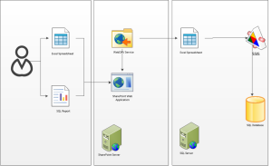

A common scenario for using WebDAV is for a SQL Server Integration Services (SSIS) package to read an Excel spread sheet stored in a SharePoint document library. The package imports the contents into a SQL database.   Business users are able to upload Spread sheets using SharePoint (no IT involvement required), data can automatically be imported (using scheduled SQL Jobs), and users can view reports (through Reporting Services in SharePoint Integrated Mode) with up-to-date data.  Here’s a diagram:



When configuring WebDAV, make sure the WebClient service is installed and started on the server hosting the SSIS package.  This service allows the server connect to SharePoint via WebDAV.  By default, Windows Server does not have the WebClient service installed.  In Windows Server 2008 R2, this is bundled up with the “Desktop Experience” feature

The authentication using FQDN issue is caused by the WebClient service only allowing credentials to be passed to local intranet sites – without checking Internet Explorer settings.  A URL is considered local intranet if it is not fully qualified, such as “SPWFE01”.  If the URL contains a period, it is considered Internet, such as “intranet.mycompany.com”.

The behaviour you are likely to see when trying to access FQDN is:

```
HTTP 401: Authentication Error.
```

You can check this by reading the IIS logs on the SharePoint web application.

To allow a specified FQDN URL to have credentials passed, we need to add a registry key to specify the FQDN URL(s).  First, open the following location in Registry Editor:


```
Computer\HKEY_LOCAL_MACHINE\SYSTEM\CurrentControlSet\services\WebClientParameters
```

Create a new key (Mult-String), called “AuthForwardServerList”.

Edit the key, and add the relevant URLs (one URL per line).  For example:

```
http://intranet.mycompany.com
http://*.companyxyz.com
```

Note that all sites/libraries under the URL will be allowed as well.

Finally, restart the WebClient service.

Now WebDAV should work correctly and credentials forwarded appropriately for the specified FQDN(s).
