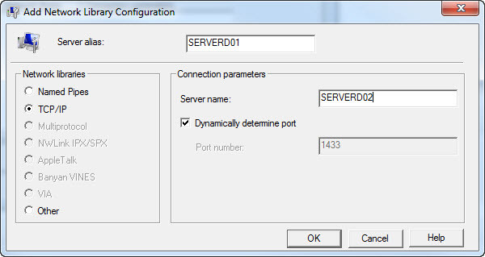

A SQL Alias is an alternate name used to make a database connection.

Aliases are configured on the client machine, not the database server.  Therefore, the SQL Server Native Client is required on the client servers.

Let’s say we have a SharePoint web server on SERVERW01 and all databases are on SERVERD01.  The scenario is that SERVERD01 needs to be decommissioned and all databases moved to SERVERD02.

We can easily do this using SQL Aliases, without making any modifications to SharePoint configuration.

Context based, you may want to use explicit IP address, or the server name.  There are pros and cons for each.  If you are not sure I would advise using the server name as if the IP changes on the DB server, the alias will still work.

Here is the process to add a SQL Alias:

1. Run “cliconfg.exe” (Note the missing “i” in config)
2. Select the Alias tab
3. Click Add
4. Select TCP/IP
5. Enter the name of the Alias (in our scenario: SERVERD01)
6. Enter the name of the new server (in our scenario: SERVERD02)
7. Click OK

