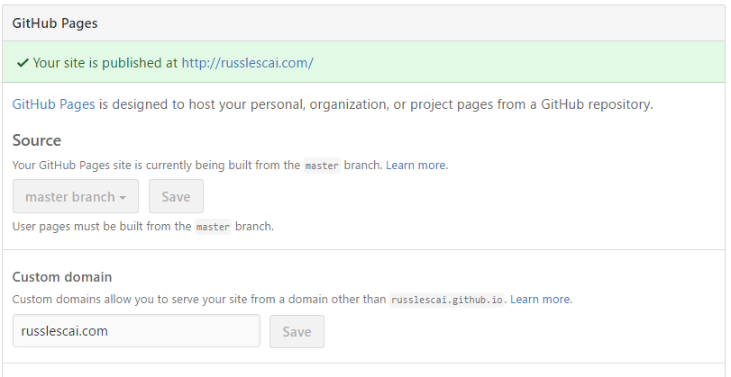
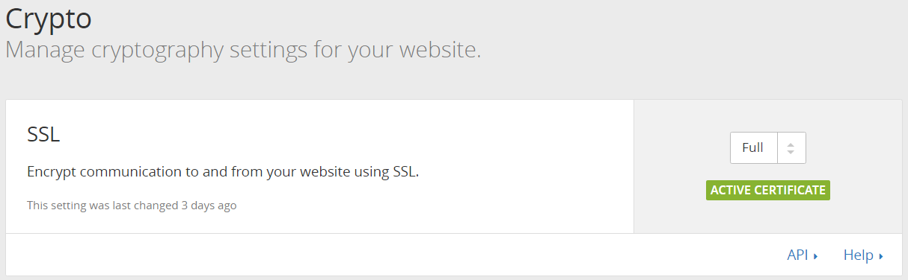
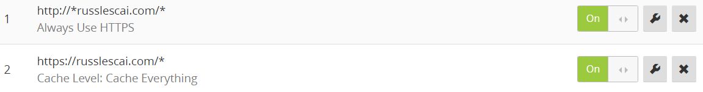
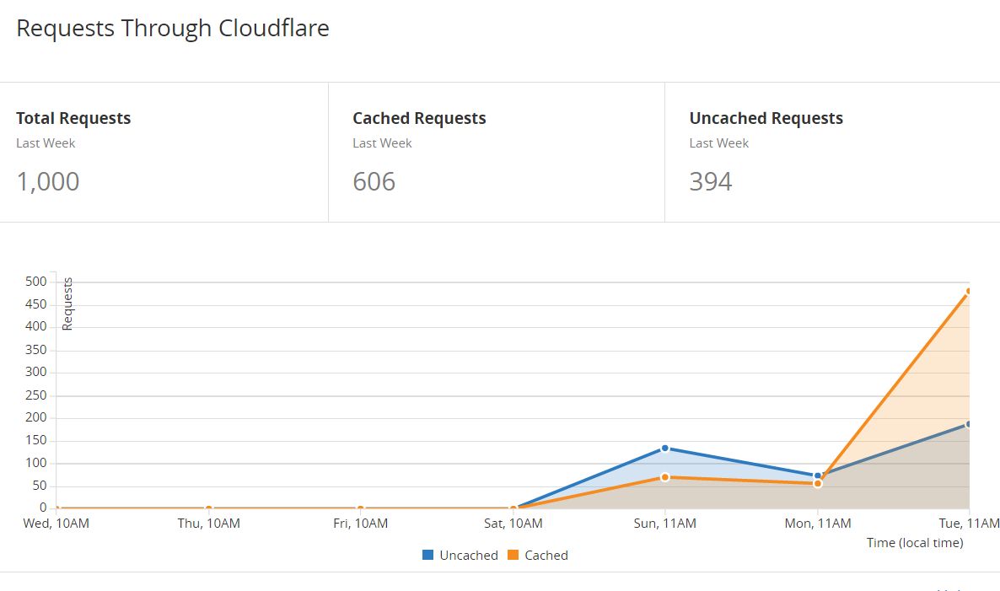

I am in the process of refreshing my blog, including setting up a custom domain, and setting up HTTPS by default. I've used WordPress for my free blog previously, but want to explore other options, and keep  management as simple as possible.

I set out with several objectives for my new blog. Firstly, it has to be cost effective. Not just cheap, but value for money. I want to spend more effort working on content, rather than managing hosting servers or updating software. Thirdly, future proof. If (when) I find this blog has outgrown itself - a good problem to have - I want it to be as easy as possible to expand.

The first decision point was hosting options. I shortlisted [WordPress](https://www.wordpress.com), [Ghost](https://www.ghost.com) and [Github Pages](https://pages.github.com/).  I don't want to manage software patching or server updates, and some hosting providers do not always keep the platform up to date. Therefore, the host has to be SAAS (Software As A Service).

I investigated WordPress first, as my (albeit limited) content is already there, and I am familiar with the toolset. There are lots of themes to choose from too. While it is a free service, it is (currently) $17 per month to use a custom domain. While this isn't a huge amount,  $400 per year is significant considering my current blog size and traffic. WordPress has had their fair share of vulnerabilities as well. However I can somewhat mitigate vulnerabilities by not using third party plugins and using hosted services (which means it is kept up to date).

Next I looked at Ghost. I first heard of Ghost from security blogger [Troy Hunt](https://www.troyhunt.com), who recently moved his blog over to Ghost and wrote an interesting [article](https://www.troyhunt.com/creating-blog-for-your-non-techie/) about his experiences. Ghost looks modern and easy to use. As of today, it starts at $20 per month, with higher plans as you expand.

I have previously played with Github Pages with development projects.  Hosted on Github, it is a git repository which is transformed into static HTML using [Jekyll](https://jekyllrb.com/docs/github-pages/).  The free price tag makes it very appealing for me to start out, and uses static HTML pages (output), which improves the performance impact of CloudFlare caching (more on this later). Github Pages also support custom domains for free. The drawback for this is it doesn't provide a nice UI for content authoring as others do, but this is OK for me at this point.   

In the short term, I have decided that Github Pages is a good starting point, with the option to move to Ghost or another product as my blog expands.  I've started from an existing Jekyll template, which is responsive and reasonably simple. It also includes support for [Disqus](https://www.disqus.com) comments.

I've registered my domain, configured the domain in Github UI for my Github Pages repository, and updated my domain DNS to point to Github Pages.

The next step is to setup HTTPS.  [CloudFlare](https://www.cloudflare.com) provides a great way to start with free HTTPS support (including auto-renew of certiicates), among other features. I created a free CloudFare account, and added my custom domain. It automatically imported existing DNS configuration, and took no time at all to setup. I found conflicting information on the web about whether Github Pages supports Full HTTPS for traffic between CloudFlare and Github, however a CloudFlare [blog post](https://blog.cloudflare.com/secure-and-fast-github-pages-with-cloudflare/) from a few months back confirmed Full SSL mode is supported (and provides a good explanation for setting it up). This means that it is HTTPS all the way from visitor to Github servers. I also setup two Page Rules in CloudFlare: to Cache all content, and always use HTTPS.

I found the HTTPS certificate was working for me after about 20 minutes, but on my home network it had cached the github.io certificate. It took about 24 hours for the cache to expire. If it isn't working for you straight away, try it on a different network/device to check if it works.

That's it! I had SSL setup, with caching. One of the other great features of CloudFlare is the Analytics, very clear summary of traffic.  From the graph below, I can see how traffic, including how much is cached.  

