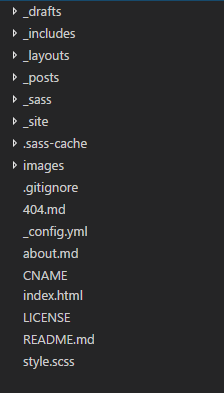
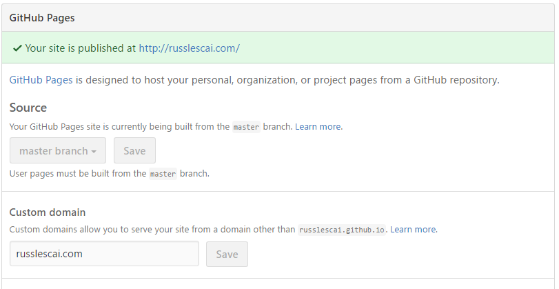

As you may know, I am using [Github Pages](https://pages.github.com) to host my blog.  I previously wrote about [setting up CloudFlare and hosting for my blog](./2016-10-05-setting-up-cloudflare-and-pages-to-host-my-new-blog).  In this post I will go into some more detail about getting started with Github pages.

Before going too far, I will mention this a technical article and a basic knowledge of git and markdown is required.

If you don't already have a Github account, sign up (it's free for public repositories) for a new account.  Think carefully about the account username, as it will be your subdomain for your blog if you choose not to use a custom domain.


Next step is to create a new public repository. The name is *very* important, as it will notify Github to use this repository for pages. If my Github account name is "russlescai", the new reopsitory name needs to be "russlescai.github.io". This will be the URL of your site, and Github will add settings for you to configure.

Initially your repository is empty, and will not display anything until you have uploaded content. You could start from scratch, but I highly recommend having a look around for an existing template which contains the type of layout you want.  You can customise or tailor later, if you like. I used [jekyll-now](https://github.com/barryclark/jekyll-now) as a starting point.

To upload content, you are going to need to get your hands dirty with git. Step 1 is to get a local copy of the template.  You can use a graphical Git IDE (e.g. [Github Desktop](https://desktop.github.com/)) or [SourceTree](https://www.sourcetreeapp.com/), or here are the commands in your favourite console.  Assuming you are using jekyll-now as a template, and russlescai, the commands would be the following.

```
git clone https://github.com/barryclark/jekyll-now russlescai.github.io
cd russlescai.github.io
git remote set-url origin https://github.com/russlescai/russlescai.github.io
git push origin master
```

In short, the commands above downloads a copy of the jekyll now template source, then points the repository to your newly created repository, and finally uploads to your new repository.

You should find after about 5 minutes, you can access your site at `http://<yoursite>.github.io`.  As a bonus, you will also be able to access your site using HTTPS too!

Obviously, you will want to make some changes to details like site name and URL. Global configuration is found in `_config.yml` file in the russlescai.github.io folder.



The folder structure is standard across most Jekyll projects.  You can find all post files in `_posts` folder, and common templates in `_layouts` folder. I also created a `_drafts` folder for adding draft posts without making them available to the public.

In the `_posts` folder there is usually a sample post, which will help you get started quickly. The second most important part of each post is the first three lines (the most important is of course the content!):

```
---
layout: post
title: Getting Started with Github Pages
---  
```

These lines tell Jekyll which layout template to use, and the title of the post. There are other optional items, but these are the common two.  

Posts are written using Markdown, which is translated to HTML automatically by Github on upload.

Once you have added your posts, to upload them, you need to run the following git commands:

```
git add .
git status
git commit -m "Updates to posts."
git push origin master
```

The first two lines tells git to include all changes (new posts, changes to existing posts) when uploading. It will also display which files will be affected. The third line commits the changes into the local repository, and finally uploads to the Github repository.

I have setup Jekyll to run on my machine, which allows me to preview my blog locally, however this is not straightforward, and may be the topic of a future blog post.

Finally, if you do have a custom domain (e.g. flyingcrown.com), you can configure it by navigating to the repository in Github (https://github.com/flyingcrown/flyingcrown.github.io), click the Settings tab, and half way down the page you will see "Custom Domain." Note the message which says https is not currently supported for custom domains, CloudFlare can provide this for us instead.



As I said, there are some technical elements to using Github Pages, but for those familiar with basic Git workflow and HTML it is worth checking out.
